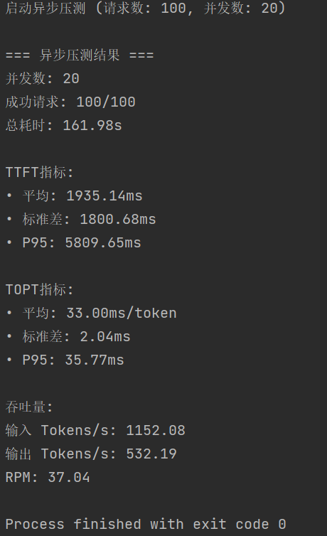

# VLLM performance Benchmark test Tool

[](https://www.python.org/)
[](https://opensource.org/licenses/MIT)

一个高性能异步LLM服务压测工具，支持流式响应分析和详细性能指标统计

## 功能特性

✅ **多维度性能指标**  
- 首Token时间（TTFT）
- Token输出速率（TOPT）
- 输入/输出Tokens吞吐量
- 请求成功率统计
- 分位数统计（P95等）

🚀 **异步架构**  
- 基于asyncio的并发控制
- 支持流式响应处理
- 可配置的并发级别
- 智能请求队列管理

📊 **测试报告**  
- 标准统计指标（均值/标准差）
- 详细耗时分析

## 使用场景

- 模型服务压力测试
- API性能基准测试


## 快速开始
修改main中的config，有必要的话加上apikey
```bash
python test_performance.py
```

### 安装依赖
```bash
pip install openai asyncio
```
