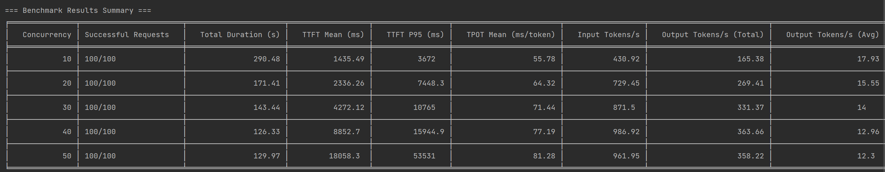
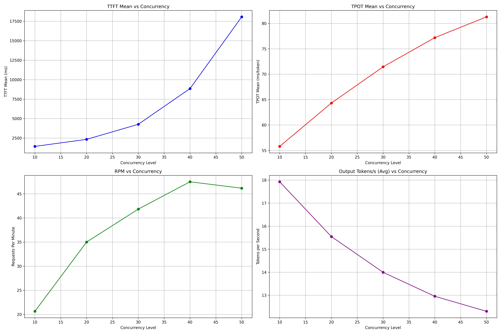

# LLM performance Benchmark test Tool

[](https://www.python.org/)
[](https://opensource.org/licenses/MIT)

一个高性能异步LLM服务压测工具，支持流式响应分析和详细性能指标统计，LLM performance Benchmark test Tool.
A Python script for benchmarking LLM serving performance under different concurrency levels using asynchronous requests. Provides detailed metrics and visualizations.

## 功能特性

✅ **多维度性能指标**  
- 首Token时间（TTFT）
- Token输出速率（TOPT）
- 输入/输出Tokens吞吐量
- 请求成功率统计
- 分位数统计（P95等）

📊 **测试报告**  
- 标准统计指标（均值/标准差）
- 详细耗时分析

## 使用场景

- 模型服务压力测试
- API性能基准测试


## 快速开始
配置测试参数 (修改main()函数)
```bash
    base_url = "http://xxx:8000/v1"
    model = "Qwen/QwQ-32B"
    num_requests = 100
    concurrency_levels = [10,20,30,40,50]
```
### 安装依赖
```bash
pip install openai asyncio tabulate matplotlib
```

查看结果:

文本报告: benchmark_results.txt

可视化图表: benchmark_chart.png


